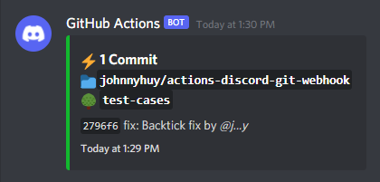

# Discord Webhook

> All credits go to the initial release by [baked-libs/discord-webhook](https://github.com/baked-libs/discord-webhook).

This is a hard fork of the original Discord Webhook GitHub Action, which was specifically catered towards Java development. This is one a slightly more generic one where we just want to post commits via webhooks.



## :mailbox_with_no_mail: Inputs

### `webhook_url`

**Required** The GitHub webhook URL comprised of both `id` and `token` fields.

### `id`

> This is ignored if `webhook_url` is set

**Required** This is the id of your Discord webhook, if you copy the webhook url, this will be the first part of it.

### `token`

> This is ignored if `webhook_url` is set

**Required** Now your Discord webhook token, it's the second part of the url.

### `censor_username`

Censor username with by only showing the first and last character. For example, `j...y` as `johnnyhuy`.

### `repo_name`

Specify a custom repository name to overwrite the `username/repo` format.

### `hide_links`

Hide links on embedded view.

### `color`

Color of the Discord embed.

## :scroll: Usage

To set up this Action, create a new workflow file under `.github/workflows/workflow_name.yml`.

```yaml
name: Discord Webhook

on: [push]

jobs:
  git:
    runs-on: ubuntu-latest
    steps:
      - uses: actions/checkout@v2

      - name: Run Discord Webhook
        uses: johnnyhuy/actions-discord-git-webhook@main
        with:
          webhook_url: ${{ secrets.YOUR_DISCORD_WEBHOOK_URL }}
```

### Alternatives

```yaml
# Disable URL links to the repository
- name: Run Discord Webhook
  uses: johnnyhuy/actions-discord-git-webhook@main
  with:
    webhook_url: ${{ secrets.YOUR_DISCORD_WEBHOOK_URL }}
    hide_links: true

# Censor username
- name: Run Discord Webhook
  uses: johnnyhuy/actions-discord-git-webhook@main
  with:
    webhook_url: ${{ secrets.YOUR_DISCORD_WEBHOOK_URL }}
    censor_username: false

# Using an ID and token
- name: Run Discord Webhook
  uses: johnnyhuy/actions-discord-git-webhook@main
  with:
    id: ${{ secrets.YOUR_DISCORD_WEBHOOK_ID }}
    token: ${{ secrets.YOUR_DISCORD_WEBHOOK_TOKEN }}

# Using a custom repo name
- name: Run Discord Webhook
  uses: johnnyhuy/actions-discord-git-webhook@main
  with:
    id: ${{ secrets.YOUR_DISCORD_WEBHOOK_ID }}
    token: ${{ secrets.YOUR_DISCORD_WEBHOOK_TOKEN }}
    repo_name: My Special Repo
```

## Development

NodeJS should be the only hard requirement to get this project working to make changes. Optionally, we can use Docker Compose to provide this dependency in container with a volume to our host to make additional code changes.

```bash
# Local
npm ci

# Docker
docker-compose build workspace
docker-compose run --rm workspace
npm ci
```

### Versioning

Changes are versioned via GitHub Actions that use [`standard-version`](https://github.com/conventional-changelog/standard-version) to create Git tags and [`conventional-github-releaser`](https://github.com/conventional-changelog/releaser-tools/tree/master/packages/conventional-github-releaser) to submit GitHub releases.

We follow the [`Conventional Commits`](https://www.conventionalcommits.org/en/v1.0.0/#summary) standard where commit messages get _automatically_ analysed to produce a generated semantic version.
